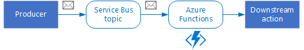
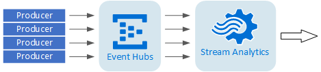
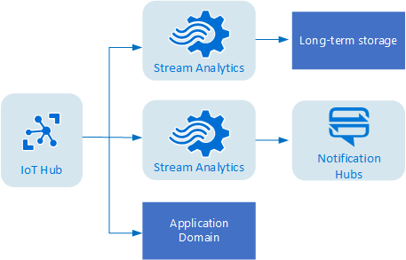

# Event-driven architecture

In an event driven architecture (EDA), application behavior is driven by asynchronous events, using a publish-subscribe (pub-sub) model. In some systems, such as IoT, events must be ingested at very high volumes.

At its heart, an EDA consists of event producers and event consumers. Events are delivered asynchronously, using a publish/subscribe messaging system. Consumers subscribe to events. The producers are independent from the consumers, and consumers are independent from each other. 

The source of the events may be external to the system, such as physical devices in an IoT solution. In that case, the system must be able to ingest the data at the volume and throughput that is required by the data source. Typically, event driven architecture is applied to a subsystem of a larger application. 

This archicture style has several flavors, depending on the volume and velocity of the event data, and the complexity of the processing by the consumers.

**Simple event processing**. An event immediately triggers an action in the consumer. For example, you could use Azure Functions with a Service Bus trigger, so that a function executes whenever a message is published to a Service Bus topic.

 
**Complex event processing**. A consumer processes a series of events, looking for patterns in the event data, using a technology such as Azure Stream Analytics or Apache Storm. For example, you could aggregrate readings from an embedded device over a time window, and generate a notification if the moving average crosses a certain threshold. 

**Event stream processing**. Use a streaming service to ingest events, with multiple consumers for different subsystems of the application. IoT workloads fall into this category.

 

