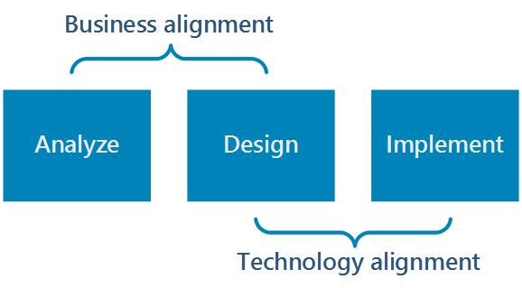

# Azure Application Architecture Guide

The cloud is changing the way applications are built and architected. Instead of monoliths, applications are being decomposed into smaller, decentralized services. These services communicate through APIs or by using asynchronous messaging or eventing. Applications scale horizontally, adding new instances as demand requires.  

These trends bring new challenges. Application state is distributed. Data may be eventually consistent. Work is distributed too. Operations are done in parallel and asynchronously. The system as a whole must be resilient when failures occur. Deployments must be automated and predictable. Monitoring and telemetry are critical for gaining insight into the system.

This guide presents a structured approach for designing applications on Azure that are scalable, resilient, and highly available. It is intended for architects and engineers who are designing solutions for Azure. 

> This is not a how-to guide for individual services in Azure, which are covered in the documentation for those services.

### Traditional vs modern cloud 

| Traditional on-premises | Modern cloud |
|-------------------------|--------------|
| Monolithic, centralized | Decomposed, de-centralized
| Design for predictable scalability | Design for elastic scale |
| Relational database | Polyglot persistence (mix of storage technologies) |
| Strong consistency | Eventual consistency |
| Serial and synchronized processing | Parallel and asynchronous processing |
| Design to avoid failures (MTBF) | Design for failure. (MTTR) |
| Occasional big updates | Frequent small updates |
| Manual management | Automated self-management |
| Snowflake servers | Immutable infrastructure |

## How this guide is structured

In this guide, we describe a series of steps on the path from design to implementation. Each step involves decisions about the architecture, starting with the most fundamental: What kind of architecture are you building? A Microservices architecture? A more traditional N-tier application? A Big Data solution?

As you move from design to implementation, the descisions become more granular and local. Should you place a message queue between two components? Can the application recover from a transient network failure? Using a structured approach helps you to keep the right focus at each stage. You move from the big picture to the particulars, and avoid making premature techical decisions early in the process.

For each step of the process, we point to related guidance on the Azure Architecture Center. This guide serves as a roadmap, while the supporting content goes deeper into each area.

## Analyze the business domain

Analyze the business domain to derive functional and non-functional requirements. ...

